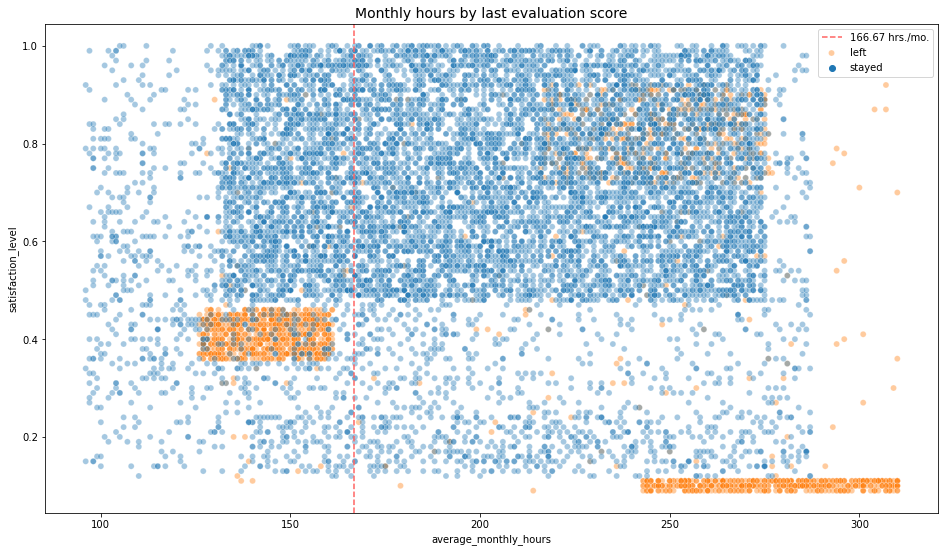
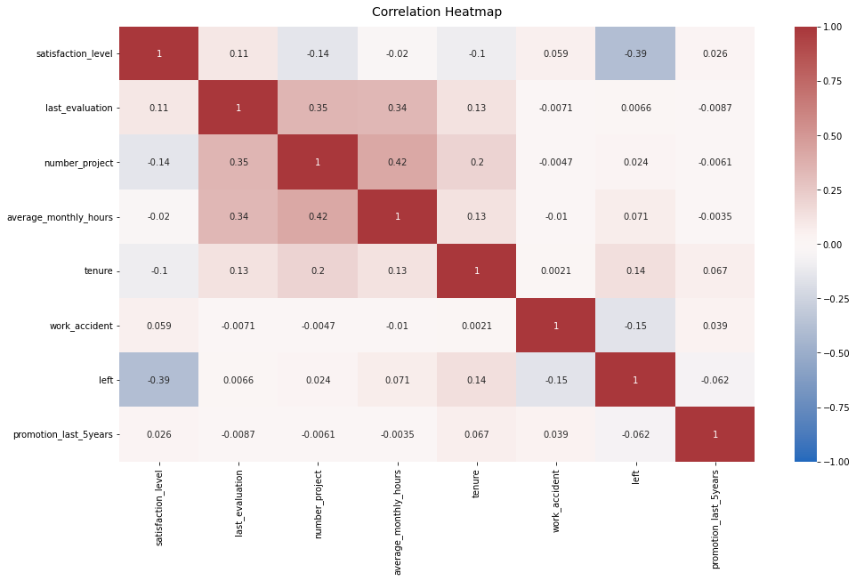

# 🌷 Salifort Motors — Employee Retention Analysis

> **Data analytics portfolio project** · HR analytics · exploratory analysis · predictive modeling

This project analyzes employee data from **Salifort Motors** to understand factors associated with employee turnover and to build models that can predict whether an employee is likely to leave.

The project was developed from the supplied Google/Coursera-style capstone notebook and is organized here as a portfolio-ready GitHub repository.

---

## ✨ Project at a glance

**Business question**

> What factors are associated with employees leaving Salifort Motors, and can we build a model to identify employees who may be at risk of leaving?

**Dataset**

- 14,999 original records
- 10 variables
- Employee satisfaction, performance, projects, working hours, tenure, promotion history, department and salary
- The notebook identifies **3,008 duplicate rows** and removes them, leaving **11,991 records** for the main analysis.
- After cleaning, approximately **16.6%** of employees in the analyzed data had left.

**Main analytical approaches**

- Exploratory data analysis
- Logistic regression
- Decision tree
- Random forest
- Feature engineering
- Cross-validation
- Confusion matrix and classification metrics
- Feature importance analysis

---

## 📊 Key findings

The supplied notebook identifies several variables as particularly useful for predicting employee departure:

1. **Last evaluation**
2. **Number of projects**
3. **Tenure**
4. **Overworked status**

The tree-based analysis suggests that workload and project load are important signals. The exploratory analysis also shows distinct groups of employees who left, including employees working unusually long hours and employees with lower satisfaction.

The notebook's final feature-engineered random forest achieved:

| Metric | Test result |
|---|---:|
| AUC | **93.8%** |
| Precision | **87.0%** |
| Recall | **90.4%** |
| F1-score | **88.7%** |
| Accuracy | **96.2%** |

> These figures are results reported by the supplied notebook. They should be treated as model performance on this dataset, not as a guarantee of performance after deployment.

---

## 🧁 Visual highlights

### Employee workload & projects


### Monthly hours & satisfaction


### Correlation overview


### Random forest feature importance


### Model confusion matrix


---

## 💡 Business recommendations from the analysis

The supplied notebook proposes several actions for HR stakeholders:

- Review the number of projects assigned to employees.
- Investigate dissatisfaction among employees around the four-year tenure mark.
- Review expectations and compensation around long working hours.
- Make overtime, workload and time-off policies clearer.
- Use company-wide and team-level discussions to understand workload and work-culture issues.
- Review how performance evaluations and rewards relate to employee workload.

These are **data-informed suggestions from the project**, not causal conclusions. The dataset is observational, and some variables may reflect information that would not be available at the moment a real retention intervention is made.

---

## ⚠️ Data & modeling caveats

The notebook itself flags possible **data leakage**. In particular:

- `satisfaction_level` may not always be available for every employee at prediction time.
- `average_monthly_hours` may reflect circumstances that occur after an employee has already decided to leave or has been identified for termination.
- `last_evaluation` may also deserve additional investigation before deployment.

The project therefore creates an `overworked` feature and removes detailed satisfaction/hours information for the feature-engineered modeling round.

This makes the final model more realistic for the stated use case, but further validation would still be needed before using such a model in an actual HR setting.

---

## 🗂️ Repository structure

```text
salifort-motors-employee-retention/
│
├── README.md
├── ABOUT.md
├── requirements.txt
├── .gitignore
│
├── notebooks/
│   └── salifort_motors_employee_retention.ipynb
│
├── images/
│   ├── correlation_heatmap.png
│   ├── department_retention.png
│   ├── monthly_hours_vs_evaluation.png
│   ├── monthly_hours_vs_satisfaction.png
│   ├── projects_and_monthly_hours.png
│   ├── random_forest_feature_importance.png
│   ├── random_forest_confusion_matrix.png
│   └── ...
│
├── docs/
│   ├── PROJECT_EXPLANATION.md
│   └── DATA_DICTIONARY.md
│
└── src/
    └── README.md
```

---

## 🚀 Running the notebook

The notebook expects the HR dataset as:

```text
HR_capstone_dataset.csv
```

The dataset itself is **not included in this repository package**.

### 1. Clone the repository

```bash
git clone https://github.com/YOUR-USERNAME/salifort-motors-employee-retention.git
cd salifort-motors-employee-retention
```

### 2. Install dependencies

```bash
pip install -r requirements.txt
```

### 3. Add the dataset

Place `HR_capstone_dataset.csv` in the notebook's working directory.

### 4. Open the notebook

```bash
jupyter notebook notebooks/salifort_motors_employee_retention.ipynb
```

---

## 🛠️ Tools & skills

`Python` · `Pandas` · `NumPy` · `Matplotlib` · `Seaborn` · `Scikit-learn` · `Jupyter Notebook` · `Exploratory Data Analysis` · `Classification` · `Feature Engineering` · `Model Evaluation`

---

## 🌼 Portfolio note

This project demonstrates an end-to-end analytics workflow:

**Business question → data cleaning → EDA → feature engineering → modeling → evaluation → business recommendations**

The goal is not simply to build a model, but to translate employee data into information that an HR team could use to investigate retention challenges.

